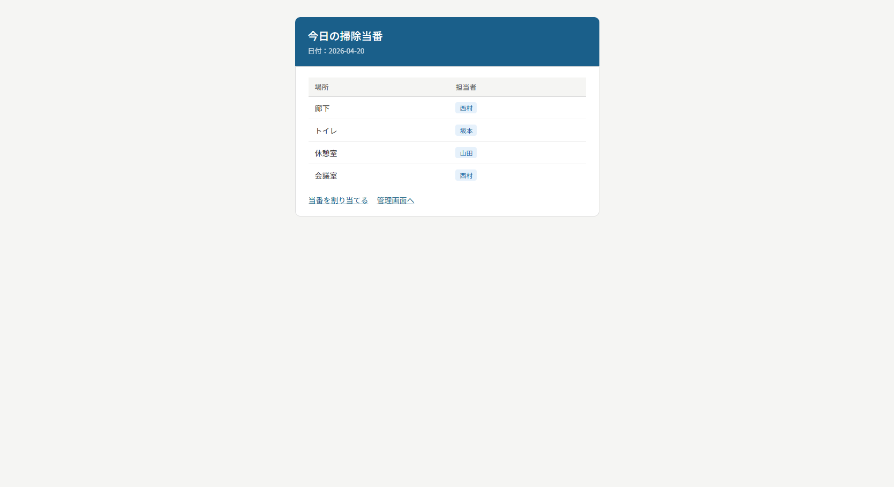
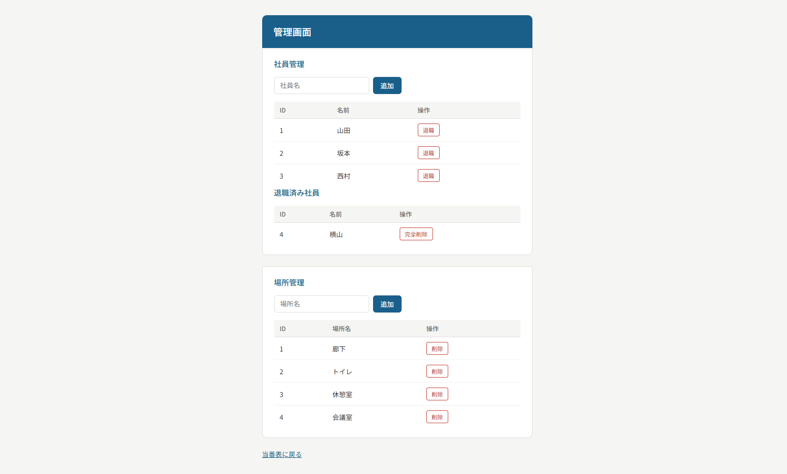

# 🧹 掃除当番自動割り当てシステム

今日の日付を取得して、社員が公平に当番になるよう自動で割り当てる掃除当番表Webアプリです。

---

## 開発背景

「誰が何回やったか」を手動で管理する手間をなくしたいと考え、当番履歴をDBで管理して自動で公平に割り当てる仕組みを作りました。PHP・MySQLの基礎をひととおり自力で実装することを目標に開発しました。

---

## 公開URL

🧹 **https://ayako-k.com/cleaning/**

---

## 画面一覧

| 画面 | 説明 |
|---|---|
| 当番表 | 今日の掃除当番を表示 |
| 管理画面 | 社員・掃除場所の追加・削除 |

### 当番表

### 管理画面

---

## 主な機能

- 掃除当番の自動割り当て（当番履歴を参照して公平に割り当て）
- 当番表の表示
- 社員・掃除場所の管理（追加・削除）
- 二重割り当て防止
- 履歴に残っているデータの削除防止

---

## 工夫したポイント

- `prepare`と`execute`を分けてSQLインジェクション対策を実施
- `htmlspecialchars()`でXSS対策を実施
- 外部キー制約でデータの整合性を保持
- 当番回数が少ない社員から優先的に割り当てることで公平性を確保
- 履歴に登録されている社員・場所を削除しようとした場合、理由を含めたエラーメッセージを表示

---

## 技術スタック

| 項目 | 技術 |
|---|---|
| バックエンド | PHP |
| データベース | MySQL |
| フロントエンド | HTML / CSS |
| 開発環境 | XAMPP |

---

## DB設計

| テーブル名 | 説明 |
|---|---|
| employees | 社員情報 |
| locations | 掃除場所情報 |
| schedule | 当番履歴 |
