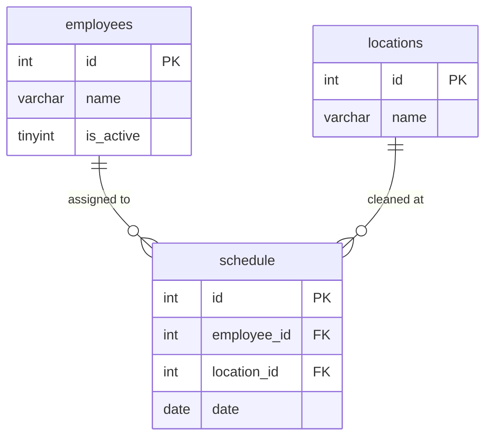

# ER図（データベース設計）

## テーブル構成



## 設計のポイント

### 1. シンプルな3テーブル構成
- **employees**：社員管理
- **locations**：掃除場所管理
- **schedule**：当番割り当て履歴（多対多の中間テーブル）

### 2. 論理削除の採用
`employees.is_active` カラムで社員の在籍状態を管理。

- `is_active = 1`：在籍中
- `is_active = 0`：退職済み

退職済み社員のデータは物理削除せず、過去の当番履歴を保持します。

### 3. 外部キー制約
- `schedule.employee_id` → `employees.id`
- `schedule.location_id` → `locations.id`

外部キー制約により、存在しない社員や場所への割り当てを防止します。

### 4. 公平な割り当てアルゴリズム
当番回数をカウントし、回数が少ない順に社員を取得：

```sql
SELECT e.id, e.name, COUNT(s.id) as count
FROM employees e
LEFT JOIN schedule s ON e.id = s.employee_id
WHERE e.is_active = 1
GROUP BY e.id
ORDER BY count ASC, e.id ASC
```

### 5. 二重割り当て防止
同じ日に複数回割り当てられないよう、`date` でチェック：

```sql
SELECT COUNT(*) FROM schedule WHERE date = CURDATE()
```

### 6. 削除時のデータ整合性
- **社員の論理削除**：`is_active = 0` に更新（過去の履歴は保持）
- **社員の完全削除**：確認ダイアログ後、`schedule` テーブルの関連データも削除
- **場所の削除**：履歴に残っている場所は削除不可（外部キー制約でエラー）

```sql
-- 場所を削除する前に履歴をチェック
SELECT COUNT(*) FROM schedule WHERE location_id = ?
```