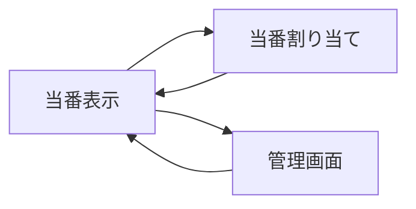

# 画面設計書

## 画面一覧

| No | 画面名 | ファイル名 | 概要 |
|----|--------|-----------|------|
| 1 | 当番表示 | index.php | 今日の当番を表示 |
| 2 | 当番割り当て | assign.php | 自動で当番を割り当て |
| 3 | 管理画面 | admin.php | 社員・場所の管理 |

---

## 画面遷移図



---

## 1. 当番表示画面（index.php）

### 目的
今日の当番を表示する

### UI要素
- タイトル：「掃除当番」
- 今日の日付表示
- 当番一覧（場所・担当者）
- 「当番を割り当てる」ボタン
- 「管理画面」リンク

### 表示ロジック

#### データ取得SQL
```sql
SELECT l.name AS location_name, e.name AS employee_name
FROM schedule s
JOIN locations l ON s.location_id = l.id
JOIN employees e ON s.employee_id = e.id
WHERE s.date = CURDATE()
ORDER BY l.id
```

#### 表示条件
- 当番データがある場合：場所ごとに担当者を表形式で表示
- 当番データがない場合：「今日の当番はまだ割り当てられていません」を表示

---

## 2. 当番割り当て画面（assign.php）

### 目的
公平に当番を自動割り当てする

### 処理フロー

#### ① 二重割り当て防止
```sql
SELECT COUNT(*) FROM schedule WHERE date = CURDATE()
```
- 件数が0より大きい場合：「今日の当番はすでに割り当てられています」を表示して中断

#### ② 掃除場所を取得
```sql
SELECT * FROM locations
```

#### ③ 在籍中の社員を当番回数が少ない順に取得
```sql
SELECT e.id, e.name, COUNT(s.id) as count
FROM employees e
LEFT JOIN schedule s ON e.id = s.employee_id
WHERE e.is_active = 1
GROUP BY e.id
ORDER BY count ASC, e.id ASC
```

#### ④ 場所ごとに社員を割り当て
```sql
INSERT INTO schedule (employee_id, location_id, date) 
VALUES (?, ?, CURDATE())
```

#### ⑤ index.phpにリダイレクト

### エラーハンドリング
- 在籍中の社員が0人の場合：「在籍中の社員がいません」を表示
- 場所が0件の場合：「掃除場所が登録されていません」を表示

---

## 3. 管理画面（admin.php）

### 目的
社員と掃除場所を管理する

### アクセス制御
- パスワード入力で管理画面に入る
- パスワードが正しくない場合：エラーメッセージを表示

### UI要素

#### 社員管理セクション
- 在籍中の社員一覧（名前・「退職」ボタン）
- 退職済み社員一覧（名前・「完全削除」ボタン）
- 社員追加フォーム（名前入力・「追加」ボタン）

#### 場所管理セクション
- 掃除場所一覧（名前・「削除」ボタン）
- 場所追加フォーム（名前入力・「追加」ボタン）

#### その他
- 「当番表に戻る」リンク

### 処理一覧

| 操作 | SQL | 備考 |
|------|-----|------|
| 社員追加 | `INSERT INTO employees (name, is_active) VALUES (?, 1)` | |
| 社員の論理削除（退職） | `UPDATE employees SET is_active = 0 WHERE id = ?` | 過去の履歴は保持 |
| 社員の完全削除 | `DELETE FROM schedule WHERE employee_id = ?`<br>`DELETE FROM employees WHERE id = ?` | 確認ダイアログ後に実行 |
| 場所追加 | `INSERT INTO locations (name) VALUES (?)` | |
| 場所削除 | `DELETE FROM locations WHERE id = ?` | 履歴に残っている場合は外部キー制約でエラー |

### セキュリティ
- XSS対策：`htmlspecialchars()` による出力エスケープ
- SQLインジェクション対策：PDOプリペアドステートメント
- パスワード認証：管理画面へのアクセス制限

### エラーハンドリング
- 場所削除時に外部キー制約エラー：「この場所は当番履歴に登録されているため削除できません」を表示

---

## デザインガイドライン

### カラーパレット
- **メインカラー**：#4A90E2（青）
- **背景**：#F5F5F5（グレー）
- **ボタン**：#5CB85C（緑）/ #D9534F（赤）

### UI原則
- シンプルで見やすいテーブル形式
- ボタンは大きめで押しやすく
- エラーメッセージは赤で目立たせる